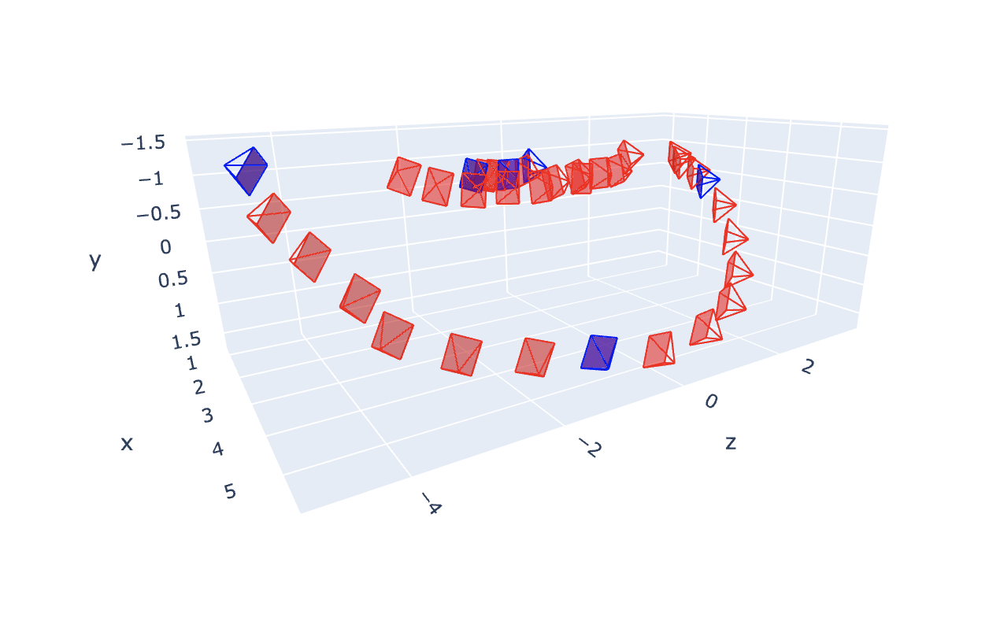

# pyramidify
An interactive notebook for placing camera poses (pyramids) in your scene for rendering NeRFs.

Here's a guide for using NVIDIA NGP without their GUI (using a Colab GPU):

### Step 1: Images
* Take some images of a scene using any camera.
* Try to revolve around an origin rather than making panoramas.
* Make sure the images aren't blurry.
* Around 30-50 images should be enough.

### Step 2: COLMAP
* Run COLMAP Automatic Reconstruction on the images.
* Export your model as text files.
* You should get these:
```
  camera.txt
  images.txt
  points3D.txt
```


### Step 3: transforms.json
* Place images and text files like this:
```
  images
    0001.jpeg
    0002.jpeg
    ...
  data
    camera.txt
    images.txt
    points3D.txt
```
* Run transforms.ipynb.

### Step 4: base_cam.json
* Place camera poses for rendering using base_cam.ipynb.
* Change FOV accordingly.


### Step 5: Nvidia NGP
* Open NGP.ipynb in Google Colab.
* Turn on GPU in runtime.
* Upload images, transforms.json and base_cam.json.
* You should get something like this:

